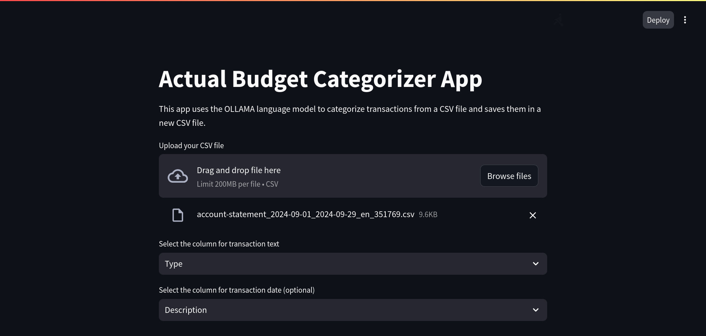

# Actual Budget Categorizer

This is a simple UI application designed to categorize transactions for [Actual Budget](https://actualbudget.com/) using a local Large Language Model (LLM) powered by the [Ollama](https://ollama.ai/) server. This project was inspired from [actual-ai], however I wanted to use a local LLM for the categorization rather than OpenAI APIs for obvious privacy reasons and use actualpy port of the official JS APIs to fetch categories from Actual server instance.

The tool can be ran locally using Python and Streamlit and allows users to upload transaction data from a CSV file, select relevant columns, filter transactions by date, and then categorize transactions into predefined categories.

## How to use

- **CSV File Upload:** Upload your transaction data in CSV format.
- **Flexible:** You can specify which column to use to categorize transactions, you can also filter transactions per date.
- **Category Selection:** Select or deselect categories to be used for categorization.
- **Local LLM Integration:** Utilize a local LLM via Ollama server for secure and efficient processing.
- **Output Export:** View the categorized transactions and download them as a CSV file.
- **Adaptable:** While designed for Actual Budget, the tool can be easily adapted for other budgeting solutions.




## Prerequisites

This project is built in Python
- **Python 3.8+**
- **Python Packages:**
  - `streamlit`
  - `pandas`
  - `actual` (custom module)
  - `llm` (custom module)
  - `config` (custom module)
- **Ollama Server:** Install and run the Ollama server for LLM capabilities.
- **Actual Budget Server:** If using with Actual Budget, ensure the Actual server is running and accessible.

## Installation

Start by cloning this project from Github with `git clone https://github.com/annis-souames/actual-categorizer`, you can then either run automatic setup or install requirements manually.

### Automatic Setup

I've added a `setup.sh` script, this script performs the following operations:
- Check if Ollama is downloaded, if not, it downloads the latest Ollama version
- Pull the llama3 model and run the ollama model server in background if it's not running already.
- Install the python packages with pip.

Before running the `setup.sh`, it is recommended to use a virtual environment with Python 3.8+:

```python
python3 -m venv .venv
source .venv/bin/activate
./setup.sh
```

If you face any issues during the automatic installation, please report it in the issues section of this repo and follow the manual installation while waiting for a fix.

### Manual Setup

The manual setup is best if you have some basic CLI and pip understanding, you will need to:

- Install [Ollama] to run LLMs locally
- Pull the LLM you want, I recommend Llama 3.1 (any size is fine).
- Run the ollama server
- Clone this project and create a virtual environment with: ` 


